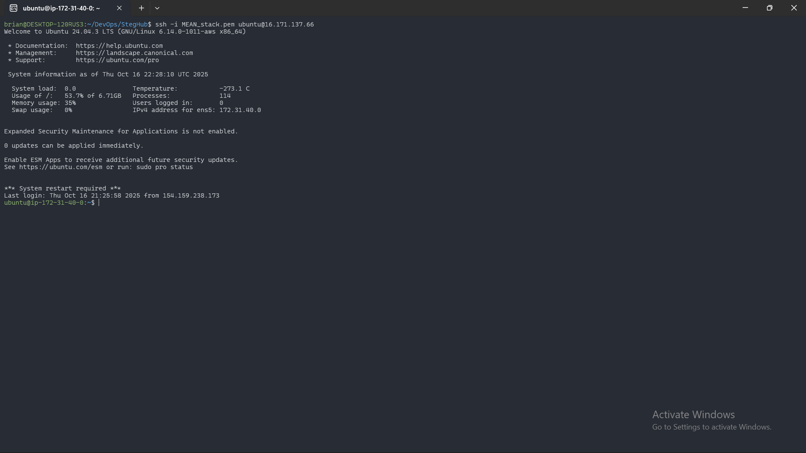
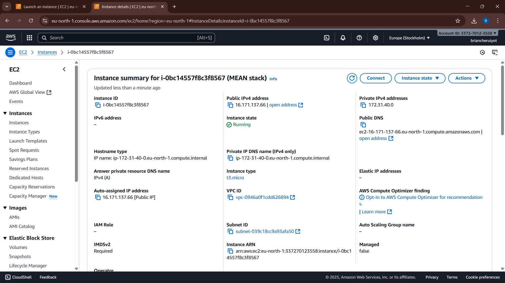
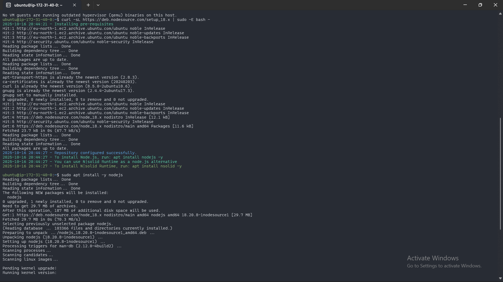
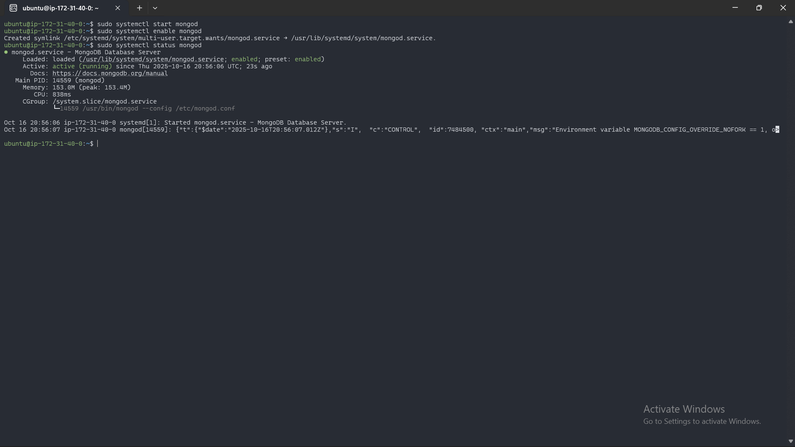
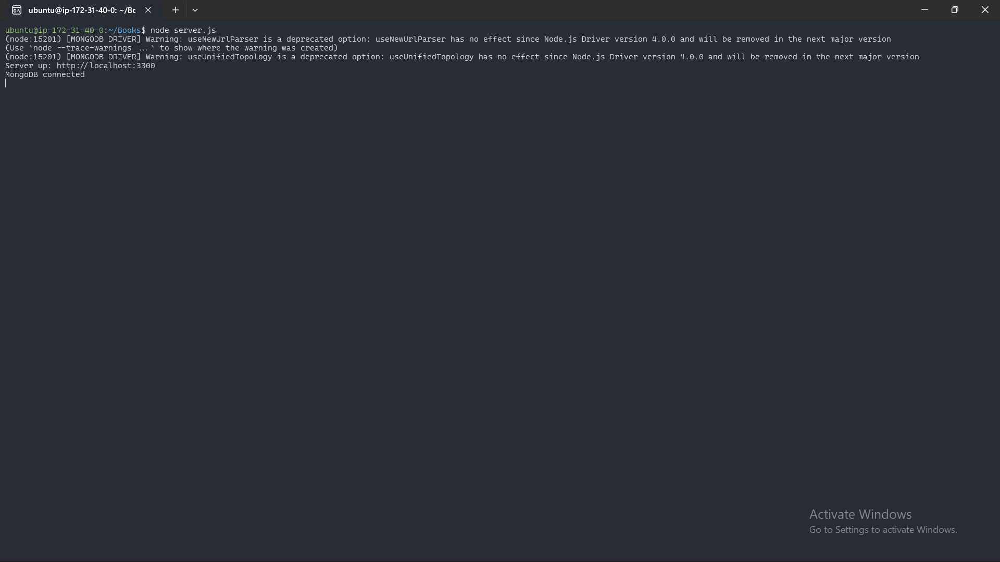
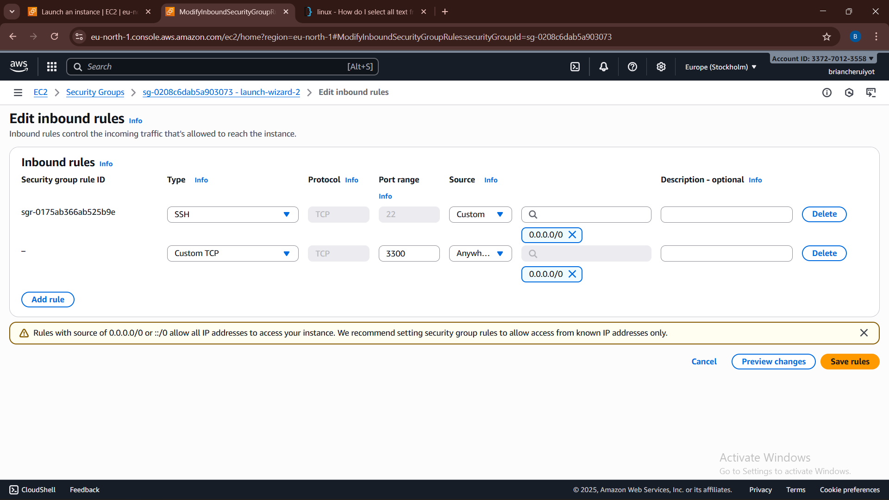
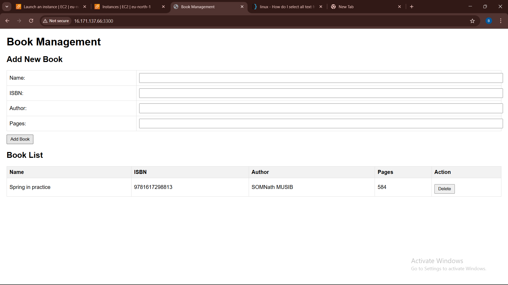

# 📚 MEAN Stack Deployment on Ubuntu (AWS EC2)

This project demonstrates the **deployment of a full MEAN (MongoDB, Express, AngularJS, Node.js)** stack web application on an **Ubuntu EC2 instance** hosted on **Amazon Web Services (AWS)**.

The application is a **Book Register Web App** that allows users to **add, view, and delete books**.  
Each book contains information such as **name**, **ISBN**, **author**, and **number of pages**.

---

## 🧩 Project Overview

**MEAN Stack Components:**

- **MongoDB** – Database for storing book records.
- **Express.js** – Backend framework that handles routing and API endpoints.
- **AngularJS** – Frontend framework for building a dynamic user interface.
- **Node.js** – JavaScript runtime environment powering the backend.

---

## 🧰 Step 1: EC2 Instance Setup

An **Ubuntu 24.04 LTS** instance was launched on AWS EC2.  
The instance serves as the server for hosting the MEAN application.

📸 *Screenshot: EC2 instance creation and status*  


📸 *Screenshot: AWS instance details*  


---

## ⚙️ Step 2: Install Node.js and npm

Node.js was installed to enable running JavaScript code on the server.  
This also installs **npm (Node Package Manager)** to manage dependencies.

```bash
sudo apt update
sudo apt upgrade
sudo apt install -y nodejs npm
node -v
npm -v
```

📸 *Screenshot: Node.js and npm installed successfully*  


---

## 🪜 Step 3: Install and Start MongoDB

Install MongoDB:

```bash
sudo apt-get install -y gnupg curl
curl -fsSL https://www.mongodb.org/static/pgp/server-7.0.asc | \
  sudo gpg -o /usr/share/keyrings/mongodb-server-7.0.gpg --dearmor

echo "deb [ arch=amd64,arm64 signed-by=/usr/share/keyrings/mongodb-server-7.0.gpg ] \
https://repo.mongodb.org/apt/ubuntu jammy/mongodb-org/7.0 multiverse" | \
sudo tee /etc/apt/sources.list.d/mongodb-org-7.0.list

sudo apt-get update
sudo apt-get install -y mongodb-org
sudo systemctl start mongod
sudo systemctl enable mongod
sudo systemctl status mongod
```

📸 *Screenshot*  


---

## 🧱 Step 4: Initialize the Node.js Application

A new project folder named **Books** was created and initialized using npm.

```bash
mkdir Books && cd Books
npm init -y
```

Installed required dependencies:

```bash
sudo npm install express mongoose body-parser
```

---

## 🖥️ Step 5: Backend Setup (Node.js + Express + Mongoose)

Created the main backend server file `server.js`:

```js
const express = require('express');
const bodyParser = require('body-parser');
const mongoose = require('mongoose');
const path = require('path');

const app = express();
const PORT = process.env.PORT || 3300;

mongoose.connect('mongodb://localhost:27017/test', {
  useNewUrlParser: true,
  useUnifiedTopology: true,
})
.then(() => console.log('MongoDB connected'))
.catch(err => console.error('MongoDB connection error:', err));

app.use(express.static(path.join(__dirname, 'public')));
app.use(bodyParser.json());

require('./apps/routes')(app);

app.listen(PORT, () => {
  console.log(`Server up: http://localhost:${PORT}`);
});
```

📸 *Screenshot: Server running successfully on port 3300*  


---

## 🧮 Step 6: Define Routes and Database Model

**File:** `apps/routes.js`  
Handles GET, POST, and DELETE operations.

**File:** `apps/models/book.js`  
Defines the Mongoose schema for book records.

**Book Schema Example:**

```js
const mongoose = require('mongoose');

const bookSchema = new mongoose.Schema({
  name: { type: String, required: true },
  isbn: { type: String, required: true, unique: true },
  author: { type: String, required: true },
  pages: { type: Number, required: true, min: 1 }
}, { timestamps: true });

module.exports = mongoose.model('Book', bookSchema);
```

---

## 🌐 Step 7: Frontend Setup (AngularJS)

**Folder:** `public/`  
Contains the AngularJS frontend files — `index.html` and `script.js`.

* **index.html** defines the user interface for the Book Register.
* **script.js** connects the frontend to the backend using `$http` requests.

**Example AngularJS Controller:**

```js
angular.module('myApp', [])
  .controller('myCtrl', function($scope, $http) {
    function fetchBooks() {
      $http.get('/book').then(response => {
        $scope.books = response.data;
      });
    }

    $scope.add_book = function() {
      $http.post('/book', {
        name: $scope.Name,
        isbn: $scope.Isbn,
        author: $scope.Author,
        pages: $scope.Pages
      }).then(() => {
        fetchBooks();
        $scope.Name = $scope.Isbn = $scope.Author = $scope.Pages = '';
      });
    };

    $scope.del_book = function(book) {
      $http.delete(`/book/${book.isbn}`).then(() => fetchBooks());
    };

    fetchBooks();
  });
```

---

## 🔐 Step 8: Security Group Configuration

Opened TCP **port 3300** in AWS Security Group settings to allow HTTP access from browsers.

📸 *Screenshot: AWS Security Group inbound rules*  


---

## 🧭 Step 9: Testing and Verification

Once the server was started:

```bash
node server.js
```

Verified functionality using:

```bash
curl -s http://localhost:3300
```

The application was accessible through:

```
http://<EC2-Public-IP>:3300
```

📸 *Screenshot: Web Book Management App running successfully*  


---

## 🧾 Design Choices and Challenges

- **Express 5 Compatibility** – Adjusted wildcard route (app.use) to avoid path-to-regexp errors.
- **MongoDB 7 Repository Setup** – Added GPG keys manually due to changes in MongoDB's packaging.
- **Error Handling** – Implemented robust try...catch blocks to return meaningful error messages.
- **Separation of Concerns** – Organized code into models, routes, and public folders for clarity.
- **AngularJS Simplicity** – Chose AngularJS for lightweight, easy integration with Express routes.

---

## 🧾 Summary

By completing this project, I successfully deployed a full **MEAN stack application** on AWS.  
The project demonstrates my ability to:

* Configure and manage a cloud-based Ubuntu server.
* Install and integrate Node.js, MongoDB, Express, and AngularJS.
* Build and connect a backend API with a dynamic frontend.
* Troubleshoot deployment and connectivity issues in a live environment.

---

## 🏁 Final Output

📸 *Screenshot: Fully functional Book Register Application*  


---

## 📄 Conclusion

*This README was generated to provide a comprehensive overview of the MEAN stack deployment project, complete with code snippets, screenshots, and design reasoning.*